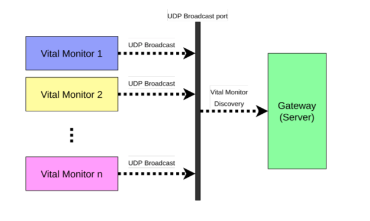
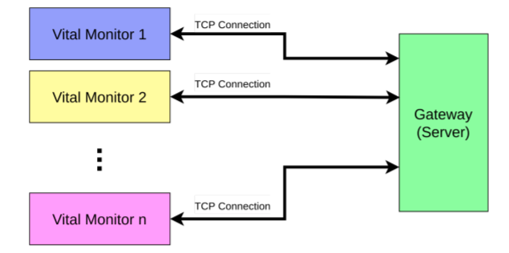

# Project:Vital-Monitor-System

## About the projcect

This project is based on a real-life scenario. In a hospital, there will be a number of patients whose vitals (things like heart rate, blood pressure, etc.) should be monitored. Each patient would be connected to a vital monitor and these monitors will transmit the vital information over a network to a central location. That way nursing staff will be able to monitor many patients and do it remotely – which is useful when the patients are contagious. 

## Specifications

There will be a set of vital monitors running. Each of these vital monitors will have an IP address. These vital monitors will be running on a server. Vital monitors will broadcast their identity to a specific UDP port in the following format:
> <ip_addr, port, monitor_id>.

## Implementations

1) Implements a gateway that discovers all of these vital monitors.
2) For each discovered monitor, the gateway initiates a TCP connection with the vital monitor. It uses the discovered port number and IP address for this connection. This TCP connection will be used to receive vital information and alarms from vital monitors.

